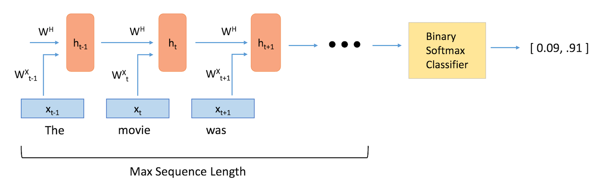

# sentiment-analysis-lstm

### Requirements
* TensorFlow -- [Homepage](https://www.tensorflow.org)
* Numpy -- [Homepage](https://numpy.org)
* Scikit-learn -- [Homepage](https://scikit-learn.org)
* Pandas -- [Homepage](https://pandas.pydata.org/)
* Natural Language Toolkit -- [Homepage](https://www.nltk.org/)



### Create and activate a virtual environment
```shell
$ virtualenv env -p python3
$ source env/bin/activate
```

Install Others Requirements
```shell
(env) $ pip3 install -r requirements.txt
```

### Dataset

Download: https://drive.google.com/drive/folders/1JygBJI7LoWsbEirleZZc21CCmbFKHNaI?usp=sharing

### Running]
```shell
(env) python3 main.py
```

<a rel="license" href="http://creativecommons.org/licenses/by-nc-sa/4.0/"></a><br />This work is licensed under a <a rel="license" href="http://creativecommons.org/licenses/by-nc-sa/4.0/">Creative Commons Attribution-NonCommercial-ShareAlike 4.0 International License</a>.